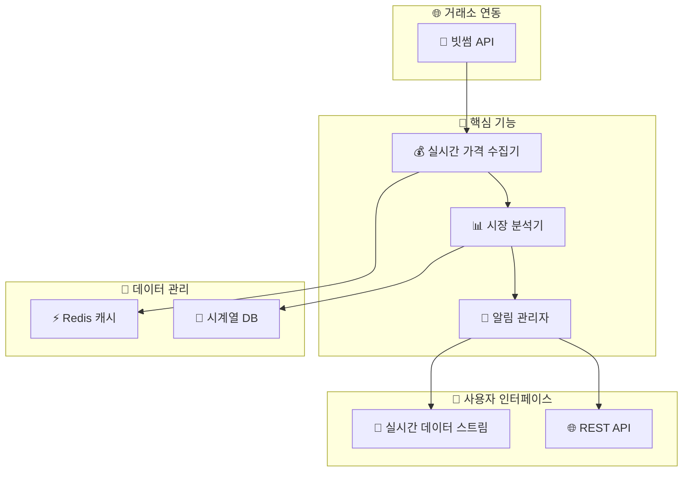

## 실시간 가상자산 시장 모니터링 플랫폼 
- 사용 기술: Java, Spring Boot, Kafka, Redis

### 개발 일지
- [개발 일지1. 중앙화 거래소 CEX 란](./개발 일지/CEX-중앙화거래소.md)
- [테스트](#)

### 핵사고날로 표현한 구조


### 간략한 시스템 구조


### 📦 `CryptoMarketMonitor` - Ports & Adapters Architecture 패키지 구조
```
🔄 데이터 흐름

외부 요청 → In Adapter → Port → Application Service → Domain → Out Port → Out Adapter → 외부 시스템
```

#### 🎯 Core (Domain & Application)
```
cryptoflow
├── 🚀 core
│   ├── 💼 domain
│   │   ├── market
│   │   │   ├── Market.java
│   │   │   ├── Candle.java
│   │   │   └── Trade.java
│   │   ├── analysis
│   │   │   ├── Pattern.java
│   │   │   └── Analysis.java
│   │   └── alert
│   │       ├── Alert.java
│   │       └── AlertCondition.java
│   └── 📊 application
│       ├── port
│       │   ├── in
│       │   │   ├── CollectMarketDataUseCase.java
│       │   │   ├── AnalyzeMarketDataUseCase.java
│       │   │   └── ManageAlertUseCase.java
│       │   └── out
│       │       ├── LoadMarketDataPort.java
│       │       ├── SaveAnalysisPort.java
│       │       └── NotifyAlertPort.java
│       └── service
│           ├── MarketDataService.java
│           ├── AnalysisService.java
│           └── AlertService.java
```

#### 🔌 Adapters (Infrastructure & Interface)
```
├── 🔄 adapter
│   ├── 📥 in
│   │   ├── web
│   │   │   ├── controller
│   │   │   │   ├── MarketController.java
│   │   │   │   ├── AnalysisController.java
│   │   │   │   └── AlertController.java
│   │   │   ├── dto
│   │   │   │   ├── request
│   │   │   │   └── response
│   │   │   └── mapper
│   │   │       └── WebDtoMapper.java
│   │   └── websocket
│   │       ├── handler
│   │       │   ├── MarketWebSocketHandler.java
│   │       │   └── AlertWebSocketHandler.java
│   │       └── mapper
│   │           └── WebSocketDtoMapper.java
│   └── 📤 out
│       ├── persistence
│       │   ├── market
│       │   │   ├── MarketRepository.java
│       │   │   ├── MarketJpaEntity.java
│       │   │   └── MarketPersistenceAdapter.java
│       │   └── analysis
│       │       ├── AnalysisRepository.java
│       │       ├── AnalysisJpaEntity.java
│       │       └── AnalysisPersistenceAdapter.java
│       ├── external
│       │   └── bithumb
│       │       ├── BithumbApiClient.java
│       │       ├── BithumbApiAdapter.java
│       │       └── dto
│       │           ├── BithumbMarketDto.java
│       │           └── BithumbMapper.java
│       ├── messaging
│       │   └── kafka
│       │       ├── KafkaProducerAdapter.java
│       │       └── KafkaConsumerAdapter.java
│       └── cache
│           └── redis
│               ├── RedisRepository.java
│               └── RedisCacheAdapter.java
```

#### ⚙️ Common (Configuration & Utils)
```
└── 🛠️ common
    ├── config
    │   ├── WebConfig.java
    │   ├── SecurityConfig.java
    │   ├── KafkaConfig.java
    │   └── RedisConfig.java
    ├── exception
    │   ├── DomainException.java
    │   └── AdapterException.java
    └── util
        ├── DateTimeUtil.java
        └── ValidationUtil.java
```
