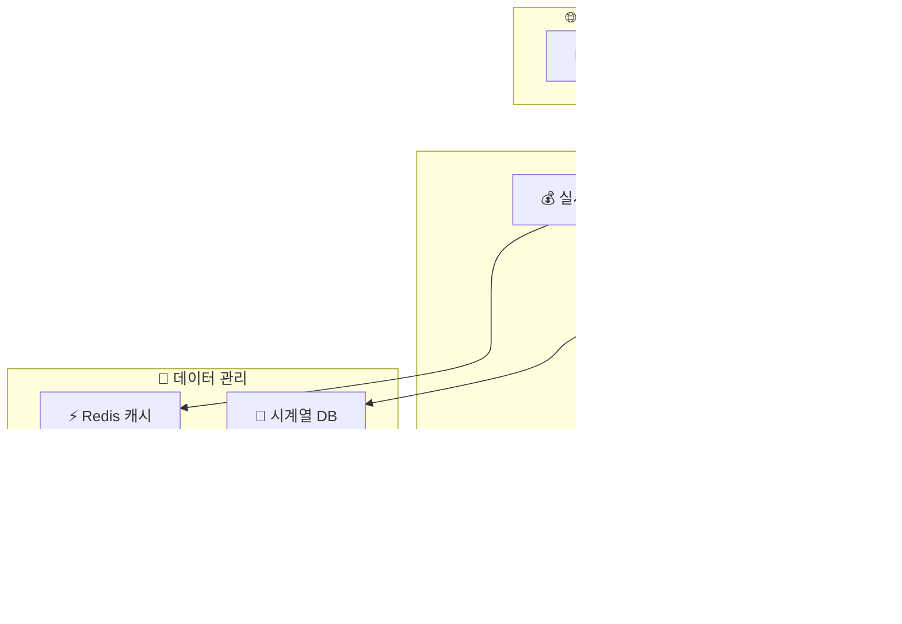

## 실시간 가상자산 시장 모니터링 플랫폼 
- 사용 기술: Java, Spring Boot, Kafka, Redis

### 간략한 시스템 구조

```mermaid
flowchart TB
    subgraph External["🌐 거래소 연동"]
        BA["💱 빗썸 API"]
    end

    subgraph Core["🔄 핵심 기능"]
        direction TB
        PC["💰 실시간 가격 수집기"]
        MA["📊 시장 분석기"]
        AA["🔔 알림 관리자"]
    end

    subgraph Storage["💾 데이터 관리"]
        RC["⚡ Redis 캐시"]
        DB["📁 시계열 DB"]
    end

    subgraph Interface["📱 사용자 인터페이스"]
        WS["📡 실시간 데이터 스트림"]
        API["🌐 REST API"]
    end

    BA --> PC
    PC --> MA
    MA --> AA
    PC --> RC
    MA --> DB
    AA --> WS
    AA --> API
```
