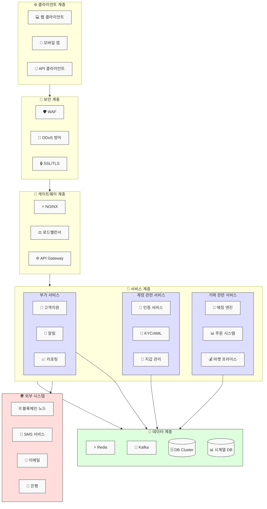

## CEX 중앙화거래소 (은행 역할!!)
> 중앙화된 기관이 운영하는 가상자산 거래 플랫폼
>> 전통적인 증권거래소와 유사한 운영 방식
>> 예: Binance, Upbit, Bithumb, Coinbase 등

### 시스템 구조 (중앙화 거래소)


### 1. 주요 특징
```
주문장(Order Book) 기반 거래
실시간 매수/매도 매칭
시장가/지정가 주문 지원
레버리지 거래 제공
```

### 2. 보안
```
KYC(본인인증) 필수
AML(자금세탁방지) 규정 준수
고객 자산 중앙 관리
콜드월렛/핫월렛 분리 운영
```

### 3. 장점
```
높은 거래 속도와 처리량
유동성 풍부
고객 지원 서비스 제공
분실 시 계정 복구 가능
사용자 친화적 인터페이스
```

### 4. 단점
```
중앙 기관에 대한 의존성
해킹 위험 존재
거래소 규정에 따른 제약
수수료 구조가 다소 높음
```

### 5. 💰수익 구조 (수수료)
```
거래 수수료 수입
입출금 수수료
토큰 상장 수수료
레버리지 거래 수수료
기타 부가 서비스 수익
```
