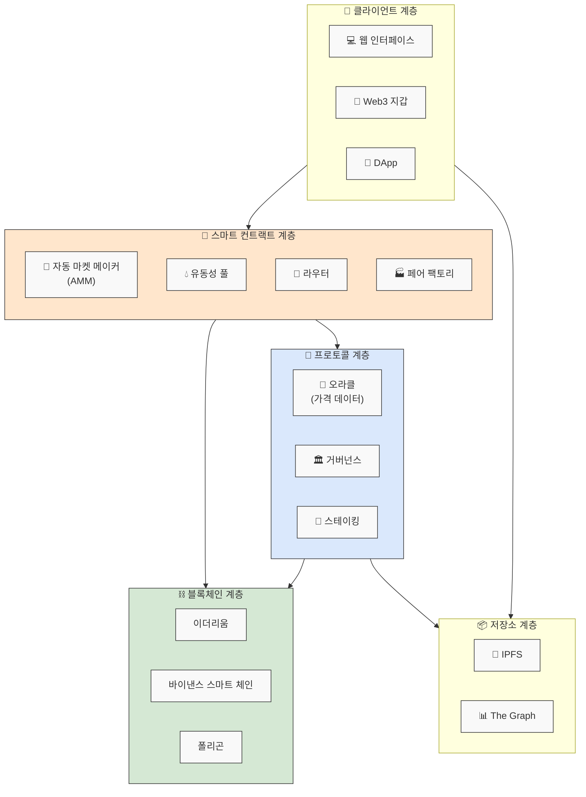
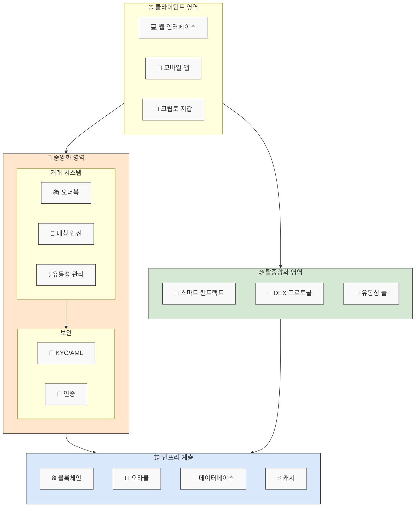

## 거래소 유형
> 크게 3가지 유형 (DEX, CEX, 하이브리드)

### 요약
```
상황: 1000만원어치 비트코인 구매 시

CEX: 
- 은행에서 거래하듯 편하게 구매
- "창구에서 직원에게 요청하면 알아서 처리해줌"

DEX: 
- 직접 지갑 연결해서 구매
- "자판기에 직접 현금 넣고 음료 뽑듯이 처리"

하이브리드:
- 일부는 자동으로, 일부는 수동으로
- "키오스크로 주문하고 직원이 확인해주는 방식"
```

#### 1. 중앙화 거래소(CEX)
> "은행"

```
은행 창구직원(거래소)이 고객의 돈(코인)을 맡아서 관리
신분증 확인(KYC) 필수
거래가 빠르고 편리함
하지만 은행이 파산하면 위험할 수 있음
```

#### 2. 탈중앙화 거래소(DEX)
> "무인 자판기"

```
중개인 없이 자동으로 거래 진행
신분 확인 없이 누구나 이용 가능
자신의 지갑(현금)을 직접 관리
기계적 규칙에 따라 가격이 결정됨
문제 발생시 도움받을 곳이 없음
```

#### 3. 하이브리드 거래소
> "무인 키오스크가 있는 식당"

```
주문은 키오스크(자동화)로
음식 준비는 요리사(중앙화)가 담당
필요할 때만 직원 도움을 받을 수 있음
자동화와 사람의 장점을 모두 활용
```

---


### 중앙화 거래소 - [개발 일지1. 중앙화 거래소 CEX 란](./CEX-중앙화거래소.md)
> 대표 거래소: Binance, Coinbase, Upbit, Bithumb

#### 특징
```
중앙화된 기관이 운영
KYC/AML 필수
높은 유동성과 거래량
사용자 친화적 인터페이스
```

### ‼️탈중앙화 거래소 (DEX: Decentralized Exchange)
> 대표 거래소: Uniswap, SushiSwap, PancakeSwap

#### 특징
```
스마트 컨트랙트 기반 운영
자동 마켓 메이커(AMM) 방식
KYC 없음
개인 지갑으로 직접 거래
```

#### 시스템 구조


#### 핵심 구성요소
```
AMM(자동 마켓 메이커): 알고리즘 기반 가격 결정
유동성 풀: 토큰 페어의 예치금 관리
스마트 컨트랙트: 모든 거래 로직 처리
Web3 지갑 연동: MetaMask 등 사용
```

### ‼️하이브리드 거래소 (Hybrid Exchange)
> 대표 거래소: Binance DEX, IDEX

#### 특징
```
CEX와 DEX의 장점 결합
일부는 중앙화, 일부는 탈중앙화 방식
향상된 보안성과 사용성
유연한 거래 방식
```

#### 시스템 구조 


#### 핵심 구성요소 (중앙화 부분)
```
오더북 관리
KYC/AML 처리
고객 서비스
```

#### 핵심 구성요소 (탈중앙화 부분)
```
자산 보관
거래 실행
유동성 풀 관리
```


---

```
기능          DEX                    하이브리드
------------------------------------------------
거래 방식     AMM 기반               AMM + 오더북
자산 보관     사용자 지갑             선택 가능
개인정보      불필요                 부분 필요
실행 속도     블록체인 속도에 종속     혼합 처리
수수료        가스비 + 유동성 수수료   하이브리드 모델
```