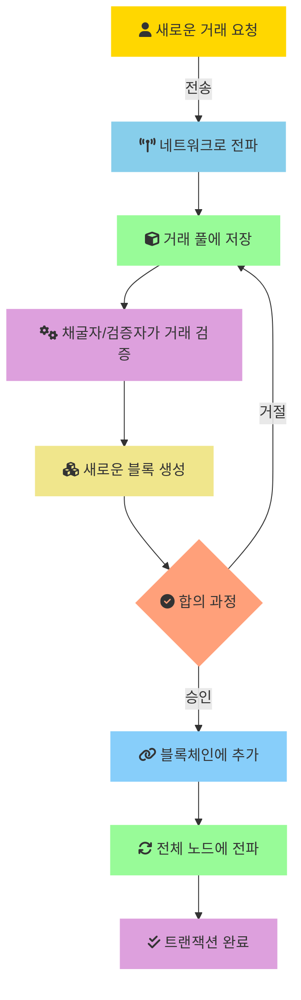
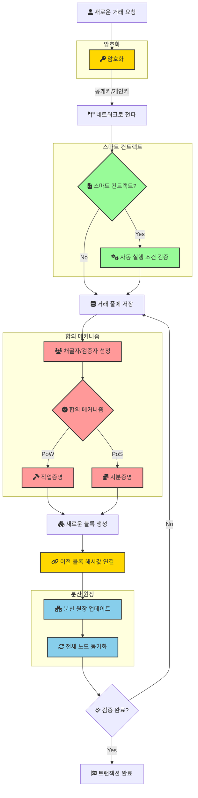

## 스마트 계약 `Smart Contract`

### 기본 개념
```
블록체인상에서 자동으로 실행되는 프로그램 코드
중개자 없이 계약 조건이 충족되면 자동으로 실행
이더리움이 가장 대표적인 스마트 계약 플랫폼
```

### 주요 특징
#### 1. 자동 실행
```
프로그래밍된 조건이 충족되면 자동으로 계약 이행
인간의 개입이나 중재 불필요
```

#### 2. 투명성
```
모든 거래와 계약 내용이 블록체인에 기록
누구나 검증 가능한 공개 원장
```

#### 3. 불변성
```
한번 배포된 계약은 수정 불가
높은 보안성과 신뢰성 제공
```

### 가상자산 거래소의 스마트 계약 활용
#### 1. 토큰 거래
```
ERC-20, ERC-721 등의 표준 토큰 계약 사용
업비트, 빗썸 등 주요 거래소에서 이더리움 기반 토큰 거래 지원
```

#### 2. 디파이(DeFi) 서비스
```
자동화된 마켓메이킹(AMM)
유동성 풀 관리
이자 수익 창출 프로그램
```

#### 3. 보안 측면
```
멀티시그 월렛 구현
콜드월렛과 핫월렛 분리 운영
자동화된 출금 승인 시스템
```

#### 4. 규제 준수
```
KYC/AML 관련 기능 구현
거래 모니터링 시스템
이상거래 탐지 및 보고
```

#### ‼️적용 사례
##### 토큰 상장
```
스마트 계약 코드 감사
토큰 발행량 및 분배 조건 검증
락업(Lock-up) 기간 설정
```

##### NFT 마켓플레이스
```
NFT 민팅 및 거래 계약
로열티 자동 지급
2차 거래 수수료 정산
```

##### 스테이킹 서비스
```
보상 자동 지급
락업 기간 관리
APY 계산 및 적용
```

##### 주의사항
```
[스마트 계약 취약점]
코드 감사(Audit) 필수
정기적인 보안 검토
비상 정지 기능 구현

[법적 고려사항]
특금법 준수
투자자 보호 장치
거래소 책임 범위
```

--- 
## 블록체인 주요 프로세스
### 동작


### 주요 상세 동작
